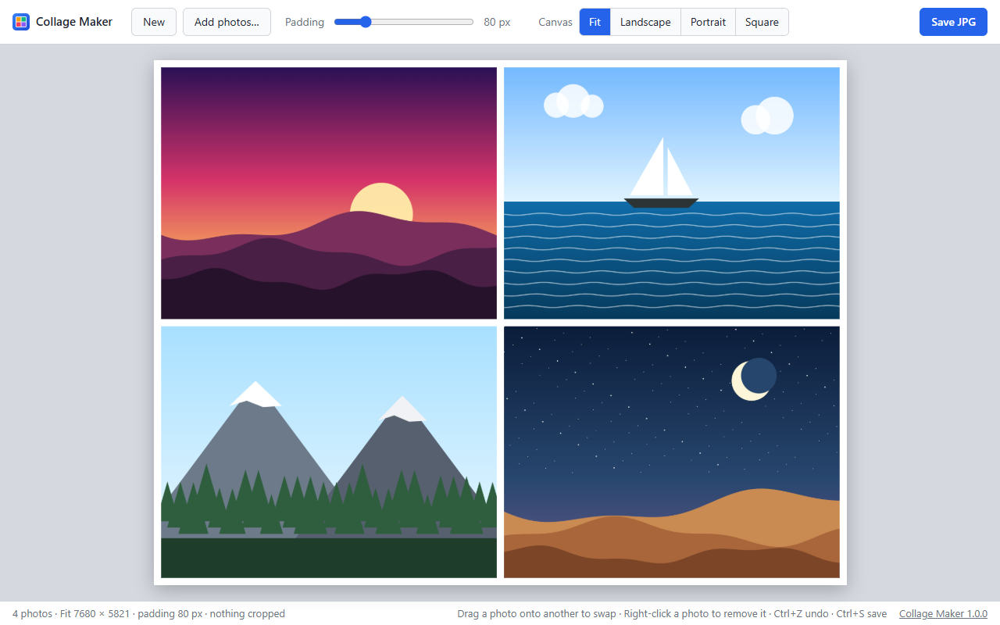

<h1> Collage Maker</h1>

[](https://github.com/khoks/collage-maker/actions/workflows/ci.yml)
[](https://github.com/khoks/collage-maker/releases/latest)
[](LICENSE)

**Drop in a few photos, get a clean 8K collage with white borders.** No accounts, no uploads, no clutter.
It's a single HTML file that runs in your browser, works offline on Windows, macOS and Linux,
and never sends your photos anywhere.



**[Try it now in your browser →](https://khoks.github.io/collage-maker/)** Nothing to install.

## Features

- **Drag and drop** photos from your file manager, paste them, or browse for them.
- **Even white borders** around and between the photos, with a **padding slider** from 0 to 400 px.
- **8K output** saved as a high-quality JPEG.
- **Fit** mode keeps your photos whole: the canvas takes their shape, so four phone photos are never cropped.
  Fixed **Landscape**, **Portrait** and **Square** 8K canvases are one click away.
- **Rearrange** by dragging one photo onto another. Right-click removes a photo; Ctrl/⌘+Z undoes it.
- **New** clears the canvas for the next collage. Nothing is stored between sessions.
- Handles phone photos properly, including their rotation (EXIF orientation).

## Install

Pick whichever suits you. Every option installs the same app and can be removed cleanly.

### Windows

**PowerShell** (no admin needed). Adds Collage Maker to the Start menu and to Settings › Apps:

```powershell
irm https://raw.githubusercontent.com/khoks/collage-maker/main/install.ps1 | iex
```

**[Scoop](https://scoop.sh/):**

```powershell
scoop bucket add collage-maker https://github.com/khoks/collage-maker
scoop install collage-maker
```

### macOS

**[Homebrew](https://brew.sh/):**

```sh
brew tap khoks/collage-maker https://github.com/khoks/collage-maker
brew install khoks/collage-maker/collage-maker
collage-maker --install-shortcut   # optional: adds Collage Maker to Launchpad and Spotlight
```

**Install script** (no sudo; also adds it to Launchpad):

```sh
curl -fsSL https://raw.githubusercontent.com/khoks/collage-maker/main/install.sh | sh
```

### Linux

**Debian, Ubuntu, Mint, Pop!_OS** and other apt-based systems:

```sh
curl -fsSLO https://github.com/khoks/collage-maker/releases/latest/download/collage-maker.deb
sudo apt install ./collage-maker.deb
```

**Any distribution**, with the install script (no sudo; adds it to your app menu):

```sh
curl -fsSL https://raw.githubusercontent.com/khoks/collage-maker/main/install.sh | sh
```

[Homebrew on Linux](https://docs.brew.sh/Homebrew-on-Linux) works too, with the same commands as on macOS.

### Portable, on any system

Download [`collage-maker.zip`](https://github.com/khoks/collage-maker/releases/latest/download/collage-maker.zip),
unzip it, and double-click **`collage-maker.html`**. That's the whole app; copy it to a USB stick or send it to a
friend. On Windows, `collage-maker.cmd` opens it in its own window, and `install.ps1` (right-click › Run with
PowerShell) installs it properly.

### As a web app

Open **https://khoks.github.io/collage-maker/** in Chrome or Edge and choose **Install** in the address bar.
You get a desktop app that works offline, on any system.

## How to use it

1. Open Collage Maker and drop in your photos. Two or four work best, but any number is fine.
2. Move the **Padding** slider until the white borders look right.
3. Pick a **Canvas** shape (Fit is usually best).
4. Click **Save JPG**. Edge and Chrome ask where to save; other browsers put the file in Downloads.
5. Click **New** to start the next collage.

| Action | How |
|---|---|
| Add photos | Drag them in, paste (Ctrl/⌘+V), or click the empty canvas |
| Swap two photos | Drag one onto the other |
| Remove a photo | Right-click it |
| Undo a removal or New | Ctrl+Z (⌘Z on a Mac) |
| Save | Ctrl+S (⌘S on a Mac) |

Photos are added in filename order.

### Canvas shapes

| Canvas | Size | Cropping |
|---|---|---|
| **Fit** (default) | 7680 px on the long edge; the other edge follows your photos | None for 2, 4, 6 or 9 photos of the same shape, and usually none for other counts; the status bar always shows how much is cropped |
| **Landscape** | 7680 × 4320 (8K UHD) | Photos are centre-cropped to fill their cells |
| **Portrait** | 4320 × 7680 | Photos are centre-cropped to fill their cells |
| **Square** | 7680 × 7680 | Photos are centre-cropped to fill their cells |

## Command line

The Homebrew, apt and script installs add a `collage-maker` command (Scoop too, on Windows):

```text
collage-maker                     open Collage Maker in its own window
collage-maker --browser           open it in a normal browser tab instead
collage-maker --install-shortcut  add it to Launchpad (macOS) or the app menu (Linux)
collage-maker --path              print where the app file is
collage-maker --help              all options
```

It opens the app in Chrome, Edge, Brave, Chromium or Vivaldi as a standalone window, or in your default browser if
none of those is installed. Set `COLLAGE_MAKER_BROWSER` to choose the browser yourself.

## Uninstall

| Installed with | Remove with |
|---|---|
| PowerShell | Settings › Apps › Installed apps › Collage Maker › Uninstall |
| Scoop | `scoop uninstall collage-maker` |
| Homebrew | `collage-maker --uninstall-shortcut` (if you added one), then `brew uninstall collage-maker` |
| apt | `sudo apt remove collage-maker` |
| Install script | `curl -fsSL https://raw.githubusercontent.com/khoks/collage-maker/main/install.sh \| sh -s -- --uninstall` |
| Portable | Delete the folder |

## Questions

**Are my photos uploaded anywhere?**
No. Everything happens inside your browser, even on the web version. The app makes no network requests at all.

**My iPhone photos (HEIC) won't load.**
Most browsers can't read HEIC. Convert them to JPG first (the Photos app on Windows and Mac can), or use Safari, which reads HEIC.

**Windows says "Windows protected your PC" when I open `collage-maker.cmd` from the zip.**
Windows warns about any downloaded script. Click *More info* › *Run anyway*, or use the PowerShell installer instead,
which doesn't trigger the warning.

**On Ubuntu, the app opened in Firefox but says the file can't be found.**
Ubuntu's Firefox and Chromium are sandboxed snaps that can't read system folders. The `collage-maker` command
handles this by giving the browser its own copy; make sure you start the app with `collage-maker` or from the app menu.

**Why are my photos cropped?**
Landscape, Portrait and Square are fixed shapes, so photos of a different shape are centre-cropped to keep the
borders even. Choose **Fit** to keep them whole.

## Contributing

Ideas, bug reports and pull requests are welcome! See [CONTRIBUTING.md](CONTRIBUTING.md) for how the project is
laid out and how to run the tests. Please follow the [code of conduct](CODE_OF_CONDUCT.md).

## License

[MIT](LICENSE) © 2026 Rahul Singh Khokhar and contributors.
